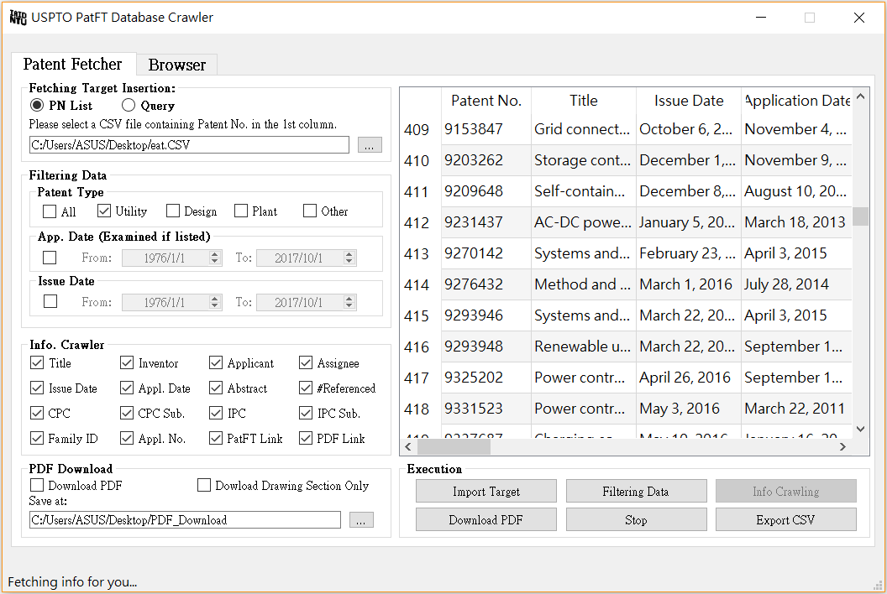
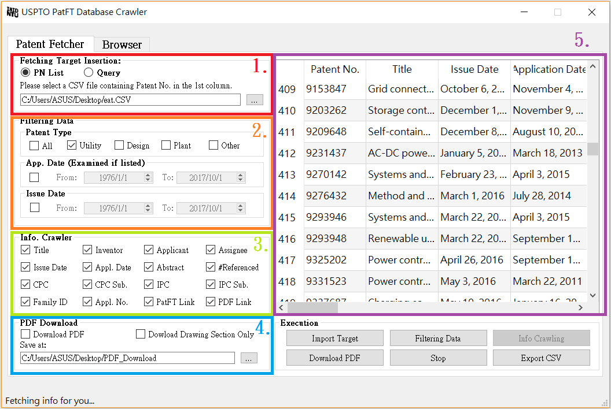
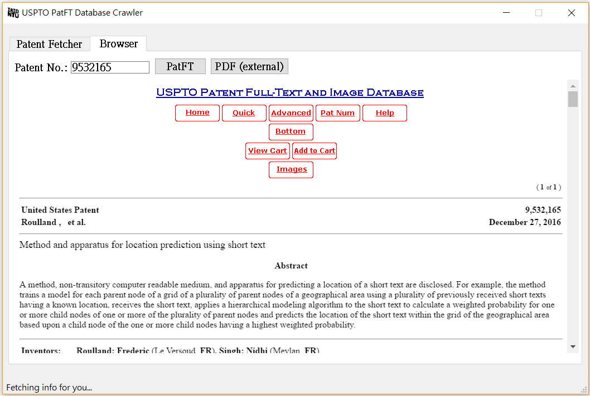

# Web Crawler of USPTO PatFT Database
Crawler for fetching information of US Patents and batch PDF download.  
preview:  

  
## Execution File Download
The source code has packaged with pyinstaller in Windows  
1.[Normal package](https://drive.google.com/open?id=0B4zCzLRoIx8eeWRwN1M3dFNTUE0)  
2.[Single .exe file](https://drive.google.com/open?id=0B4zCzLRoIx8eeG4wbUZDdVdrTDg)

## Instruction 
You can follow the instruction below or watch this [video](https://www.youtube.com/watch?v=zqSEqUk2kgg). It sould be easy :).  
### Patent Fetcher
(1) Insert PN (2) Filtering conditions (3) Information to be fetched (4) PDF type to be downloaded (5) Table  

1. Insert the patent numbers (PNs) to be processed in following ways:  
  (a) Choose a **CSV file with PNs in the first coulumn** ([example](https://github.com/mattwang44/USPTO-PatFT-Web-Crawler/blob/master/PN_sample.CSV)).  
   (b) **Search with query**. (The query should examined on PatFT.)  
   The PNs should be shown in the table.

2. (Optional) Filtering the shown PNs with **setting the patent types, range of application date & issue date**.  
   The filtered PNs are also shown on the table but will be deleted in the end of this process.

3. **Fetching the information** of patents shown in the table by web crawling.  

4. Download **PDF of full-text or drawing section** (or both simultaneously) of patents shown in the table.

5. The **table can be saved** as a CSV file anytime.  

### Browser  

In the second page, you can insert PN to show the PatFT web of this patent or open PDF with your default browser.

## Caution
1. The program has some problems when fetching information of the patents issued before 1976. Still working on it.
2. Searching with long query takes a lot of time, same as it takes on PatFT ([example](http://patft.uspto.gov/netacgi/nph-Parser?Sect1=PTO2&Sect2=HITOFF&u=%2Fnetahtml%2FPTO%2Fsearch-adv.htm&r=0&p=1&f=S&l=50&Query=%28%28%28CPC%2FA62B%24+OR+CPC%2FB65H%24%29+OR+CPC%2FF16D%24%29+OR+CPC%2FB66D%24%29+AND+%28%28brak%24+OR+lock%24%29+OR+%28retract%24+OR+rewind%24%29%29+AND+%28%28%28lifeline+OR+lanyard%29+OR+%22safety+line%22%29+OR+cable%29&d=PTXT)). I tried using threading in the program but it leads to more time consumed, and multiprocessing leads to bad connection. If you have a long query with less than 500 results, copying the patents number to a CSV file on your own and insert the file sould be faster.  
3. If you encountered any problems or have any suggestion (like adding other function), feel free to [contact me](http://mattwang44.wixsite.com/main/contact)!

  
 
